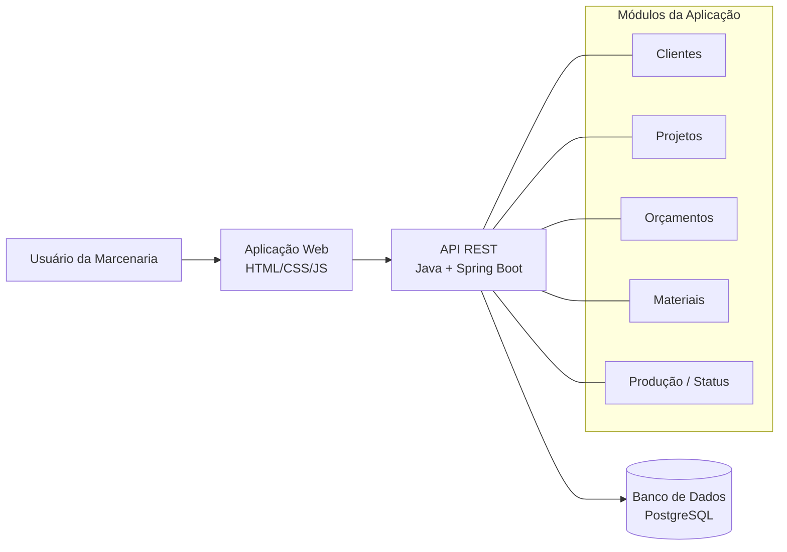

[proposta.md](https://github.com/user-attachments/files/31497222/proposta.md)
# ETAPA 01: PROPOSTA E ESPECIFICAÇÃO DO PROJETO

## 1. Nome da aplicação

**MadeiraFlow**: Sistema de Gerenciamento de Marcenaria

## 2. Descrição do problema

A maioria das marcenarias de pequeno e médio porte que trabalham com móveis planejados ainda organiza seus pedidos de forma manual: anotações em caderno, planilhas soltas, fotos e medidas trocadas por WhatsApp. Com o tempo, isso vira um problema real. É fácil perder informações de medidas e materiais, esquecer em que fase de produção um móvel está, ou fechar um orçamento e depois não lembrar exatamente o que foi combinado com o cliente.

O MadeiraFlow parte desse problema e propõe reunir em um único lugar o processo de um projeto de marcenaria: desde o momento em que o cliente pede um móvel até a entrega final, passando pelo orçamento e pelo acompanhamento da produção. A ideia não é só "cadastrar coisas", mas dar uma visão clara de tudo o que está em andamento na marcenaria a qualquer momento.

## 3. Público-alvo

O sistema é voltado para marcenarias de pequeno e médio porte que trabalham com móveis planejados e sob medida, em especial marceneiros autônomos ou pequenas equipes que hoje não usam nenhum sistema e dependem de anotações manuais. Também atende quem cuida da parte administrativa desses negócios (orçamento, atendimento ao cliente, controle de pedidos), já que grande parte do uso do sistema é justamente organizar essas informações.

## 4. Objetivo principal

Desenvolver uma aplicação web que permita à marcenaria cadastrar clientes, registrar os projetos de móveis solicitados, montar orçamentos e acompanhar o andamento de cada pedido até a entrega, substituindo o controle manual por um fluxo único e consultável.

## 5. Funcionalidades

O sistema deverá contar, ao longo do desenvolvimento, com as seguintes funcionalidades:

**Cadastro de clientes.** Permite registrar os dados de contato de cada cliente da marcenaria, para não depender de agendas ou conversas soltas para localizar essas informações.

**Cadastro de projetos.** Cada pedido de móvel é registrado como um projeto vinculado a um cliente, com a descrição do que está sendo solicitado, o ambiente de destino e observações relevantes. É o que formaliza o pedido, em vez de ficar apenas combinado verbalmente.

**Elaboração de orçamento.** A partir dos materiais e da mão de obra envolvidos, é possível montar um orçamento vinculado ao projeto, evitando divergência entre o que foi cobrado e o que realmente foi combinado com o cliente.

**Cadastro de materiais utilizados no projeto.** Cada projeto pode ter os materiais necessários associados a ele (tipo de chapa, ferragens, revestimentos, etc.), o que dá visibilidade sobre o que precisa ser comprado ou já está disponível.

**Acompanhamento do status do projeto.** O projeto passa por diferentes fases (orçamento, aprovado, em produção, em acabamento, pronto, entregue), e o sistema permite atualizar e visualizar em que fase cada um se encontra, sem precisar perguntar diretamente para quem está produzindo.

**Consulta e listagem de projetos.** Uma listagem geral dos projetos, com filtros por status e por cliente, para dar uma visão consolidada do que está em andamento, algo que hoje é praticamente impossível de enxergar rapidamente com anotações soltas.

## 6. Entidades e conceitos do domínio

**Cliente.** Pessoa física ou empresa que solicita o móvel. Guarda nome, telefone, e-mail, endereço e data de cadastro.

**Projeto.** Representa o pedido de um móvel planejado feito por um cliente. Guarda o cliente vinculado, a descrição do móvel, o ambiente de destino, o status atual, a data de criação e observações gerais.

**Orçamento.** Reúne os valores associados a um projeto (materiais e mão de obra), representando o preço proposto ao cliente. Guarda o projeto vinculado, o valor de materiais, o valor de mão de obra, o valor total, a data de emissão e o status (pendente ou aprovado).

**Material.** Item utilizado na fabricação do móvel, como chapas, ferragens e revestimentos, associado a um ou mais projetos. Guarda nome, tipo/categoria, unidade de medida, custo unitário e quantidade utilizada em cada projeto.

## 7. Telas e interfaces

**Painel de Projetos.** Tela principal do sistema, que lista todos os projetos cadastrados na marcenaria com o cliente, uma descrição resumida e o status atual de cada um. A partir dela é possível filtrar por status, buscar por cliente, abrir os detalhes de um projeto específico ou criar um novo. É o ponto de entrada para o resto do sistema.

**Cadastro e detalhes do cliente.** Tela onde é possível registrar um novo cliente ou consultar e editar os dados de um cliente já existente, junto com a lista de projetos vinculados a ele. Serve de base para o cadastro de projetos, já que todo projeto precisa estar ligado a um cliente.

**Detalhes do projeto.** Reúne em um só lugar as informações de um projeto específico: dados do cliente, descrição do móvel, status atual, materiais associados e o orçamento vinculado. Aqui é possível adicionar ou editar materiais, criar/atualizar o orçamento e alterar o status do projeto. É o núcleo do fluxo de trabalho do sistema.

**Orçamento.** Tela dedicada à montagem e visualização do orçamento de um projeto, mostrando os itens de material com seus custos, o valor de mão de obra e o valor total. Depende dos materiais já cadastrados no projeto e, ao ser aprovada, atualiza o status do projeto.

## 8. Operações do sistema

1. **Cadastrar cliente.** Registrar um novo cliente com seus dados de contato.
2. **Cadastrar projeto.** Criar um novo pedido de móvel vinculado a um cliente já cadastrado.
3. **Adicionar material ao projeto.** Associar um material, e a quantidade necessária, a um projeto específico.
4. **Criar ou atualizar orçamento.** Gerar ou revisar o orçamento de um projeto a partir dos materiais e da mão de obra envolvidos.
5. **Alterar status do projeto.** Mover o projeto entre as etapas do fluxo, por exemplo de "orçamento" para "aprovado", ou de "em produção" para "pronto".
6. **Consultar projetos.** Listar e filtrar os projetos cadastrados por cliente ou por status.
7. **Editar dados do cliente.** Atualizar as informações cadastrais de um cliente já existente.

## 9. Tecnologias do cliente

O front-end será construído com **HTML5**, **CSS3** e **JavaScript**, podendo usar um framework CSS leve, como o Bootstrap, para deixar o layout mais organizado sem exigir muito esforço de estilização. Essa combinação é simples o suficiente para validar bem o fluxo do sistema, e dá espaço para trocar por algo mais robusto (como React ou Vue) mais adiante, caso o projeto peça telas mais dinâmicas, como um dashboard.

## 10. Tecnologias do servidor

No back-end, a ideia é usar **Java com Spring Boot** para construir a API. É uma tecnologia madura, bem documentada, com uma estrutura de camadas (controllers, services, repositories) que ajuda a manter o código organizado à medida que o sistema for crescendo e ganhando novas regras de negócio.

## 11. Persistência

Para o banco de dados, a escolha é o **PostgreSQL**. As entidades do sistema (Cliente, Projeto, Orçamento, Material) têm relações bem definidas entre si: um cliente pode ter vários projetos, um projeto tem um orçamento e vários materiais. Isso se encaixa naturalmente em um modelo relacional. Além disso, o PostgreSQL é gratuito, bem documentado e se integra facilmente com Spring Boot através do Spring Data JPA.

## 12. Diagrama da solução

Na prática, o usuário interage com a aplicação web, que se comunica com a API REST em Spring Boot; a API cuida das regras de negócio e persiste os dados no PostgreSQL. Os módulos de Clientes, Projetos, Orçamentos, Materiais e Produção representam as áreas funcionais que a API expõe para o front-end.
